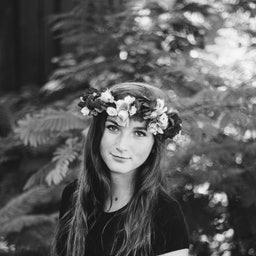
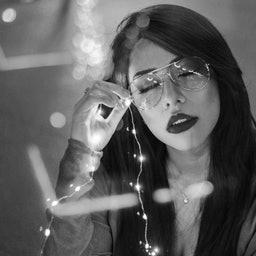
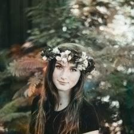

# Deep Learning Model that Colors Grayscale Images

Main Paper by Zezhou Cheng, Qingxiong Yang, Bin Sheng: [Deep Colorization](https://arxiv.org/abs/1605.00075)

## Some Predicted Results
<h4> Test Images </h4>

 

<h4> Generated Images </h4>

 

## Network Architecture

## Fusion Layer Architecture

