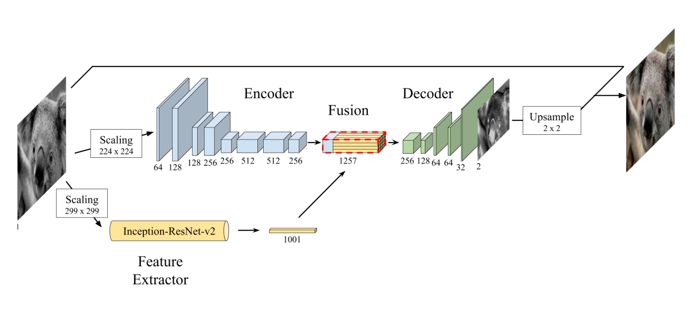
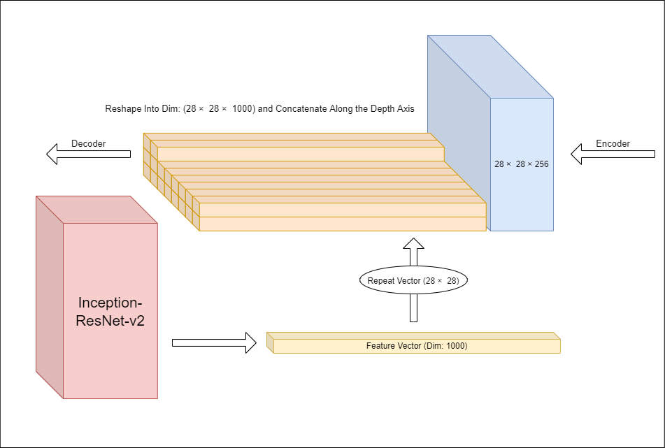

# Deep Learning Model that Colors Grayscale Images

Main Paper by Zezhou Cheng, Qingxiong Yang, Bin Sheng: [Deep Colorization](https://arxiv.org/abs/1605.00075)

## Network Architecture

## Fusion Layer Architecture

## Some Predicted Results

 

